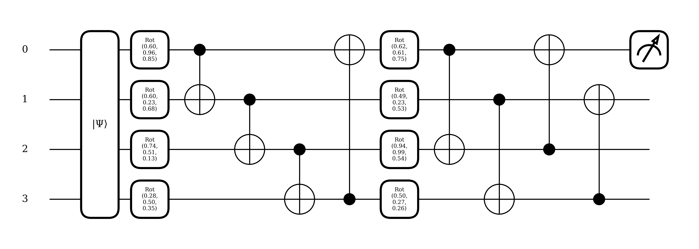
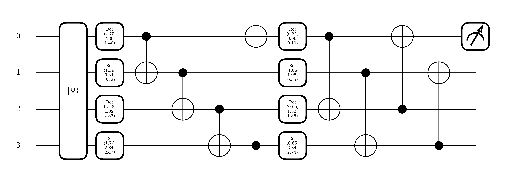
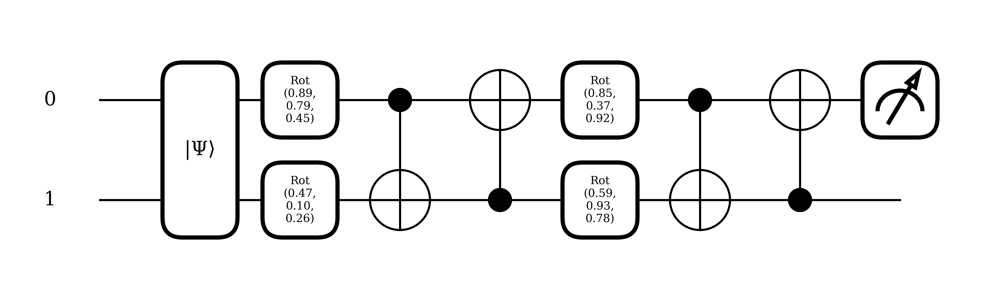

# Quantum Circuit Classification Project - BSDSA
## Overview
This repository explores the application of quantum computing techniques for various binary classification problems. Utilizing quantum circuits, this project aims to process and classify binary image data, demonstrating the potential benefits of quantum superposition and entanglement in achieving effective classification with a compact feature map.

## Project Structure
This project includes comprehensive Python scripts that address the behaviour and performance of quantum circuits under different circumstances:

### StripesClassification.py
- **Purpose**: Implements a quantum classifier to differentiate between horizontal and vertical stripes in noisy binary images.
- **Key Features**:
  - Generates synthetic binary image data with designated stripe patterns.
  - Constructs and utilizes quantum circuits for image data encoding and classification.
  - Trains quantum models to classify images and evaluates their performance.
  - Visualizes both the generated data and the performance metrics of quantum models.
  - Includes a Multi-Layer Perceptron (MLP), a Convolutional Neural Network (CNN), a Vision Transformer (ViT) and a Convolutional Vision Transformer (CVT) for performance comparison.
  - Generates and evaluates adversarial examples using PGD (Projected Gradient Descent).
- **Effectiveness**: 
  - When trained for few epochs, the Parametrized Quantum Circuit (PQC) achieves reasonable performance comparable to that of classical layers trained for five times the epochs, although it starts to overfit much earlier than the classical counterparts, with the exception of the the ViT, which was always overfitting, regardless of number of epochs or dataset size.
  - Randomly choosing which qubit to compute the expected value from during training reduces the variance of the PQC accuracy. This robustness extends to adversarial attacks, with the PQC showing higher and more consistent performance under such conditions.
  - Testing 100 times without a fixed seed demonstrated that the PQC, with only 24 parameters, consistently achieved performance comparable to classical models that have vastly more parameters—610, 2,576, and 101,954 respectively.
  - Both random and deterministic methods outperform the classical layers on PGD adversarial attacks by a wide margin when testing, both with and without a fixed seed.


**Figure 1**: The Optimized Ansatz for This Problem


### DigitClassification.py
- **Purpose**: Explores the potential of quantum neural networks by implementing a hybrid model that combines classical feature extraction with convolutional layers with quantum circuits.
- **Key Features**:
  - Trains the hybrid model to classify between images of digits 0 and 1, focusing on binary classification due to limitations in quantum simulation capabilities.
  - Initial `Conv2d` layers perform classical convolution and pooling, reducing image dimensions while preserving essential features.
  - Extracted features are then processed through a quantum circuit, leveraging quantum mechanical properties for classification.
- **Effectiveness**: 
  - The PQC demonstrates a substantial performance advantage over the traditional linear classifier, having a 46% higher accuracy.
  - Extensive testing, conducted 100 times without a fixed seed, reveals that the PQC maintains a more consistent test accuracy ranging from 60% to 100%. In contrast, the linear classifier exhibits greater variability in performance and less robustness, with accuracies spanning from a minimum of 38% to a maximum of 100%.
  - This example proves that PQCs can effectively replace a linear layer even when the data is processed through classical machine learning layers, showcasing their versatility and robustness in diverse machine learning pipelines.

**Figure 2**: The Optimized Ansatz for This Problem


### IrisClassification.py
- **Purpose**: Implements a PQC to classify the Iris flower dataset, specifically designed to distinguish between two of the three species.
- **Key Features**:
  - Preprocesses the Iris dataset by removing one species to simplify it into a binary classification task.
  - Implements both a quantum circuit and a classical neural network to perform the classification.
  - Trains, tests, and compares the performance of quantum and classical models under various conditions, including handling adversarial examples.
  - Evaluates the effectiveness of random versus deterministic sampling methods in quantum circuits during testing. 
- **Effectiveness**: 
  - The quantum model exhibited performance similar, or superior, to a model with 10 times the parameters and trained for 5 times the number of epochs
  - The quantum model is severely prone to overfitting if more epochs/layers are used
  - Comparative testing, performed 100 times without a fixed seed, indicates that the quantum model frequently matches or exceeds the performance of the classical model, particularly under adversarial conditions.
  - Introducing randomness in the qubit sampling during the training phase of the quantum model reduces variance in its accuracy, albeit the mean and median accuracy were sligthly slower when run 100 times without seed setting.
  - Introducing randomness in the qubit sampling during the testing phase of the quantum model reduces variance in its accuracy under adversarial conditions and marginally improves accuracy.

**Figure 3**: The Optimized Ansatz for This Problem

## Libraries Used
- PennyLane
- NumPy
- Matplotlib
- Seaborn
- PyTorch

## How to Run
Before running the script, make sure you have installed Python and the required libraries. Here are the steps:

  1. Ensure the following specific versions of the libraries are installed:
  - Pennylane == 0.36.0
  - Torch == 2.3.1
  - Scikit-learn == 1.5.0
  - numpy == 1.26.4
  - kaggle == 1.6.6
    
    You can install or upgrade these libraries using the command:
  ```bash
  pip install pennylane==0.36.0 torch==2.3.1 scikit-learn==1.5.0 numpy==1.26.4 kaggle==1.6.6
  ```

2. Clone or download `StripesClassification.py` or `DigitClassification.py` to your local machine.
3. Navigate to the directory where you saved the script via terminal or command prompt.
4. Adjust script parameters (e.g. epochs, optimizer, etc.) as needed.
5. Run the script with the following command:
   ```bash
   python <script_name>.py
   ```
   
## Future Expansions
In collaboration with the Bocconi Students Data Science Association (BSDSA) we aim to further enhance the capabilities of the quantum image classifier through:
- Expanding to New Datasets: Applying the developed techniques to different datasets to assess and refine the robustness and utility of our quantum classification approach.
- Scholarly Publication: Documenting our methodologies and findings in a detailed paper
