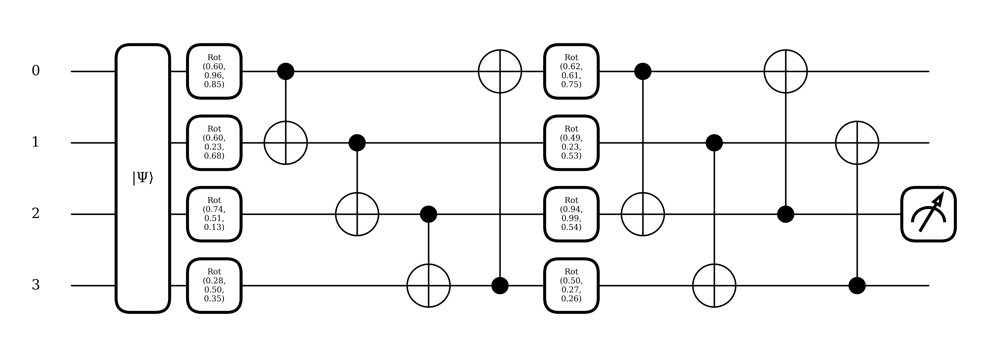
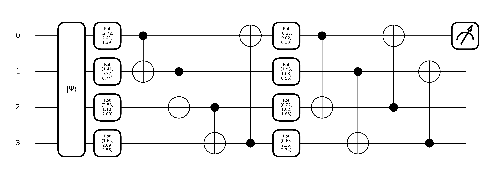

# Quantum Image Classification Project - BSDSA
## Overview
This repository explores the application of quantum computing techniques for the classification of binary images with vertical and horizontal stripes. Utilizing quantum circuits, this project aims to process and classify binary image data, demonstrating the potential benefits of quantum superposition and entanglement in achieving effective classification with a compact feature map.

## Project Structure
This project includes comprehensive Python scripts that address all critical phases from data generation to model evaluation:

### StripesClassification.py
- **Purpose**: Implements a quantum classifier to differentiate between horizontal and vertical stripes in noisy binary images.
- **Key Features**:
  - Generates synthetic binary image data with designated stripe patterns.
  - Constructs and utilizes quantum circuits for image data encoding and classification.
  - Trains quantum models to classify images and evaluates their performance.
  - Visualizes both the generated data and the performance metrics of quantum models.
  - Includes a classical neural network for performance comparison.
- **Effectiveness**: Following the configurations outlined in `StripesClassification.py`, the Parametrized Quantum Circuit (PQC) outperforms the linear classifier by a margin of 45%. Testing without a fixed seed for 100 times revealed that the PQC had consistently performance close with, or even exceeding, that of a conventional linear classifier.

**Figure 1**: The Optimized Ansatz for This Problem


### DigitClassification.py
- **Purpose**: Explores the potential of quantum neural networks by implementing a hybrid model that combines classical feature extraction with convolutional layers with quantum circuits.
- **Key Features**:
  - Trains the hybrid model to classify between images of digits 0 and 1, focusing on binary classification due to limitations in quantum simulation capabilities.
  - Initial `Conv2d` layers perform classical convolution and pooling, reducing image dimensions while preserving essential features.
  - Extracted features are then processed through a quantum circuit, leveraging quantum mechanical properties for classification.
- **Effectiveness**: In the `DigitClassification.py` script, when initialized with the designated seed, the PQC demonstrates a substantial performance advantage over the traditional linear classifier, having a 46% higher accuracy. Extensive testing, conducted 100 times without a fixed seed, reveals that the PQC maintains a more consistent test accuracy ranging from 60% to 100%. In contrast, the linear classifier exhibits greater variability in performance and less robustness, with accuracies spanning from a minimum of 38% to a maximum of 100%. This example proves that PQCs can effectively replace a linear layer even when the data is processed through classical machine learning layers, showcasing their versatility and robustness in diverse machine learning pipelines.

**Figure 2**: The Optimized Ansatz for This Problem


## Libraries Used
- PennyLane
- NumPy
- Matplotlib
- Seaborn
- PyTorch

## How to Run
Before running the script, make sure you have installed Python and the required libraries. Here are the steps:

  1. Ensure the following specific versions of the libraries are installed:
  - Pennylane == 0.36.0
  - Torch == 2.3.1
  - Scikit-learn = 1.5.0
  - numpy = 1.26.4
    
    You can install or upgrade these libraries using the command:
  ```bash
  pip install pennylane==0.36.0 torch==2.3.1 scikit-learn==1.5.0 numpy==1.26.4
  ```

2. Clone or download `StripesClassification.py` or `DigitClassification.py` to your local machine.
3. Navigate to the directory where you saved the script via terminal or command prompt.
4. Adjust script parameters (e.g. epochs, optimizer, etc.) as needed.
5. Run the script with the following command:
   ```bash
   python <script_name>.py
   ```
   
## Future Expansions
In collaboration with the Bocconi Students Data Science Association (BSDSA) we aim to further enhance the capabilities of the quantum image classifier through:
- Expanding to New Datasets: Applying the developed techniques to different datasets to assess and refine the robustness and utility of our quantum classification approach.
- Scholarly Publication: Documenting our methodologies and findings in a detailed paper
