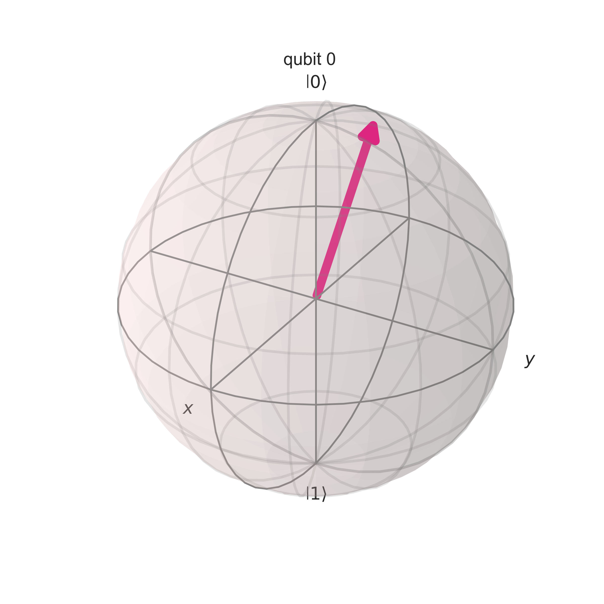
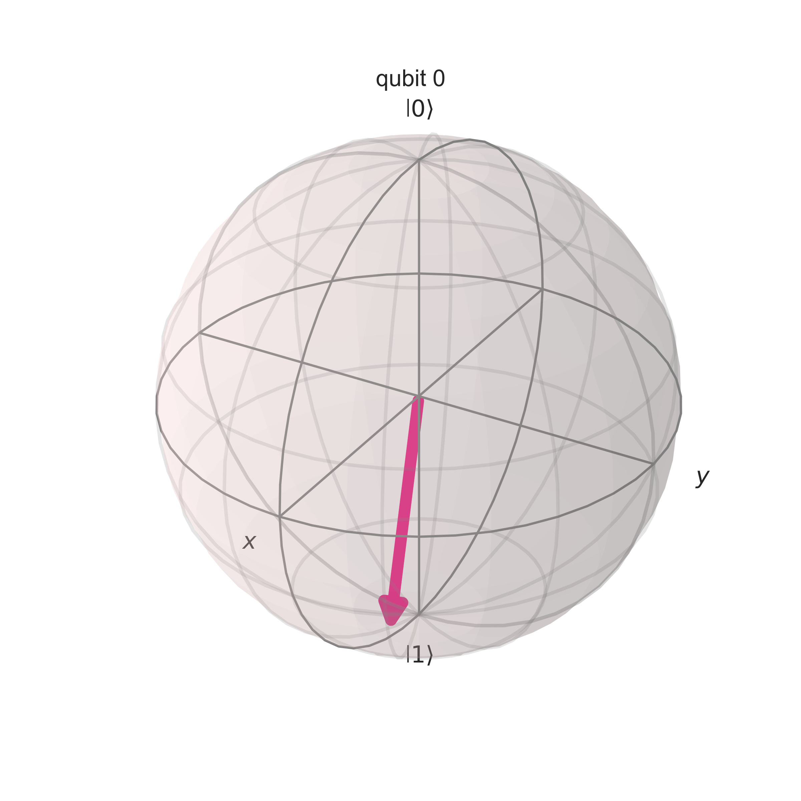

# Quantum Image Classification Project - BSDSA


## Overview
This repository hosts the project I developed, focusing on the classification of images with vertical and horizontal stripes using quantum computing techniques. 
The classifier uses a quantum machine learning framework, leveraging quantum circuits to process and classify binary image data effectively. 
Specifically, it constructs adaptive quantum feature maps to encode images into quantum states and uses variational quantum circuits to perform the classification. 
This approach allows for exploiting quantum superposition and entanglement, potentially enabling equivalent classification outcomes with a more compact feature map.
Interestingly, even with only a single qubit, after optimization the `adaptive_feature_map` shows promising results. The quantum state representations for the two labels demonstrate that the quantum states are already pointing close to the correct classification: Label 0 (encoded as |0⟩) shows the state vector pointing upwards (Figure 2), and Label 1 (encoded as |1⟩) shows the state vector pointing downwards (Figure 3).


**Figure 1:** Example of an optimized quantum circuit developed in this project.


**Figure 2:** State vector representation for Label 0.


**Figure 3:** State vector representation for Label 1.

## Project Structure
The repository consists of a comprehensive Python script that covers all aspects of the project from data generation to model evaluation:
### ImageClassification.py
- **Purpose**: Implementing a quantum classifier to distinguish between horizontal and vertical stripes in binary images.
- **Key Tasks**:
  - Generating synthetic binary image data with specified stripe patterns.
  - Building adaptive quantum feature maps and variational circuits.
  - Training quantum circuits to classify the images based on stripe orientation.
  - Evaluating the classifier's performance and optimizing quantum circuit parameters.
### circuit0.qasm
The best circuit found from the optimization process for classifying horizontal stripes
### circuit1.qasm
The best circuit found from the optimization process for classifying vertical stripes


## Libraries Used
- Qiskit
- NumPy
- Matplotlib
- Seaborn

## How to Run
Before running the script, ensure you have Python and the necessary libraries installed. For optimal performance and compatibility, it is recommended to use the following library versions:
- Qiskit version 1.1.0
- Qiskit Aer version 0.14.2
- Qiskit Algorithms version 0.3.0
These versions are specified due to the frequent updates and deprecations within the Qiskit framework, which could affect the functionality of the script if newer versions are used.

1. Download `ImageClassification.py` to your local machine.
2. Open your terminal or command promp and navigate to the directory where you have saved the script.
3. Optional configurations: You can adjust parameters such as the number of qubits, layers, and epochs within the script to explore different configurations.
4. Run the script using the following command: ```bash
python3 ImageClassification.py```
Be sure to have the recommended versions of the libraries installed to avoid potential issues with deprecated features.

## Future Expansions
In collaboration with the Bocconi Students Data Science Association (BSDSA), we are taking significant steps to advance the capabilities of our quantum image classifier. Our primary goals include:
- **Technical Enhancement**: We plan to expand the variety of quantum gates used in our variational circuits. Currently, our `layered_variational_circuit` includes only RX gates and CNOT gates. Going forward, we intend to introduce a modular framework that allows for the inclusion of various other types of quantum gates. This will enhance the adaptability of our model, allowing it to better optimize for different types of image classifications and potentially improving accuracy and efficiency.
- **Deployment on Quantum Hardware**: Transitioning from simulations to real-world applications, we plan to test and refine the classifier using actual quantum hardware. This step will allow us to evaluate the classifier's practical performance and scalability, providing insights into the real-world applicability of quantum algorithms in image classification.
- **Scholarly Publication**: We aim to formalize our findings and methodologies by writing a comprehensive paper, which will detail the behavior of the quantum classifier and provide a clear explanation of its functionalities. The purpose is to document our approach and findings, which may offer useful insights for others working in similar areas of quantum machine learning.
