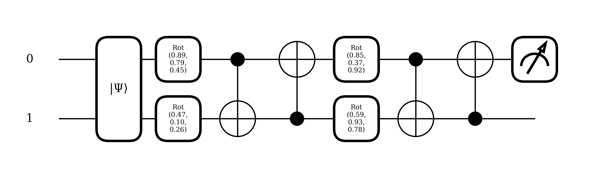

# Quantum Circuit Classification Project
## Overview
This repository explores the application of quantum computing techniques for various binary classification problems. Utilizing quantum circuits, this project aims to process and classify binary image data, demonstrating the potential benefits of quantum superposition and entanglement in achieving effective classification with a compact feature map.

## Project Structure
This project includes comprehensive Python scripts that address the behaviour and performance of quantum circuits under different circumstances:

### StripesClassification.py
- **Purpose**: Implements a quantum classifier to differentiate between horizontal and vertical stripes in noisy binary images.
- **Key Features**:
  - Generates synthetic binary image data with designated stripe patterns.
  - Constructs and utilizes quantum circuits for image data encoding and classification.
  - Trains quantum models to classify images and evaluates their performance.
  - Visualizes both the generated data and the performance metrics of quantum models.
  - Includes a Multi-Layer Perceptron (MLP), a Convolutional Neural Network (CNN), a Vision Transformer (ViT) and a Convolutional Transformer (CVT) for performance comparison.
  - Generates and evaluates adversarial examples using PGD (Projected Gradient Descent).
- **Effectiveness**: 
  - When trained for few epochs, the Parametrized Quantum Circuit (PQC) achieves reasonable performance comparable to that of classical models trained for five times the epochs, although it starts to overfit much earlier than the classical counterparts.
  - Incorporating auxiliary qubits dedicated solely to facilitating entanglement significantly enhances the performance of the model, yielding an average accuracy improvement of 32% when half of the qubits serve as ancillaries. Conversely, when no ancillary qubits are utilized, employing random sampling modestly boosts the model's accuracy, with an observed average increase of 6%.
  - Testing 100 times without a fixed seed demonstrated that the PQC, with only 48 parameters, consistently achieved performance comparable to classical models that have vastly more parameters—610, 2,576, 101,954 and 301826 respectively.
  - A PQC where half the qubits are ancillaries significantly outperforms the classical model on PGD adversarial attacks by a wide margin when testing, both with and without a fixed seed.

**Figure 1**: The Optimized Ansatz for This Problem

### AnimalFaceClassification.py
- **Purpose**: Implements a quantum classifier to differentiate between `wild`, `cat` and `dog` images.
- **Key Features**:
  - Downloads and pre-processes the AFHQ dataset.
  - Trains an hybrid PQC-MLP hybrid (QMLP) model for image classification.
  - Includes a MLP, CNN, ViT and CVT for performance comparison.
  - Generates and evaluates adversarial examples using PGD.


### DigitClassification.py
- **Purpose**: Explores the potential of quantum neural networks by implementing a hybrid model that combines classical feature extraction done by convolutional layers with quantum circuits.
- **Key Features**:
  - Trains the hybrid model to classify between images of digits 0 and 1, focusing on binary classification due to limitations in quantum simulation capabilities.
  - Initial `Conv2d` layers perform classical convolution and pooling, reducing image dimensions while preserving essential features.
  - Extracted features are then processed through a quantum circuit, leveraging quantum mechanical properties for classification.
- **Effectiveness**: 
  - The PQC demonstrates similar performance to a traditional MLP, however with 4 times less number of parameters.
  - Extensive testing, conducted 100 times without a fixed seed, reveals that the PQC maintains a more consistent test accuracy ranging from 60% to 100%. In contrast, the MLP classifier exhibits greater variability in performance and less robustness, with accuracies spanning from a minimum of 38% to a maximum of 100%.
  - This example proves that PQCs can effectively replace a MLP even when the data is processed through classical machine learning layers, showcasing their versatility and robustness in diverse machine learning pipelines.

**Figure 2**: The Optimized Ansatz for This Problem


### IrisClassification.py
- **Purpose**: Implements a PQC to classify the Iris flower dataset, specifically designed to distinguish between two of the three species.
- **Key Features**:
  - Preprocesses the Iris dataset by removing one species to simplify it into a binary classification task.
  - Implements both a quantum circuit and a classical neural network to perform the classification.
  - Trains, tests, and compares the performance of quantum and an MLP under normal and adversarial examples.
  - Evaluates the effectiveness of random versus deterministic sampling methods in quantum circuits during testing. 
- **Effectiveness**: 
  - The quantum model exhibited performance similar, or superior, to a model with 10 times the parameters and trained for 5 times the number of epochs
  - The quantum model is somewhat prone to overfitting if more epochs/layers are used
  - Comparative testing, performed 100 times without a fixed seed, indicates that the quantum model frequently matches or exceeds the performance of the classical model, particularly under adversarial conditions.
  - Introducing randomness in the qubit sampling during the training phase of the quantum model reduces variance in its accuracy, albeit the improvement is still extremely marginal if compared to the margin gained by adding more ancillary qubits
  - While the quantum model is highly effective, the predictions it generates need to be flipped to match the correct labels.

**Figure 3**: The Optimized Ansatz for This Problem


### TitanicClassification.py
- **Purpose**: Implements a PQC to classify the whether individuals on the titanic survived or not, checking how PQCs handle datasets whose size is not a power of 2.
- **Key Features**:
  - Downloads from Kaggle and preprocesses the Dataset by one hot encoding and removing observations with NAs in them.
  - Implements both a quantum circuit and a classical neural network to perform the classification.
  - Trains, tests, and compares the performance of quantum and an MLP under normal and adversarial examples.
- **Effectiveness**: 
  - The quantum model exhibited performance similar to a model with 30 times the parameters and trained for 5 times the number of epochs, with an average performance loss of 5%
  - The quantum model is somewhat prone to overfitting if more epochs/layers are used
  - Comparative testing, performed 100 times without a fixed seed, indicates that the quantum model frequently matches or comes very close to the performance of the classical model, particularly under adversarial conditions.

**Figure 4**: The Optimized Ansatz for This Problem


## Libraries Used
- PennyLane
- NumPy
- Matplotlib
- Seaborn
- PyTorch
- Einops


## How to Run

Before running the scripts, ensure that you have Python installed and the environment properly set up. Here are the steps to get started:

### Using Conda (Recommended)

1. **Clone the Repository**: Clone or download the repository to your local machine.
   ```bash
   git clone <repository-url>
   cd <repository-directory>
   ```
2. **Create and Activate the Conda Environment**: Create the environment from the environment.yaml file
   ```bash
   conda env create -f environment.yaml
   conda activate quantum_classification
   ```
   Using pip
   ```bash
   python -m venv env
   source env/bin/activate  # On Windows use `env\Scripts\activate`
   pip install -r requirements.txt
   ```
3. Once the environment is set up, you can run the scripts as follows:
  - Navigate to the directory containing the scripts.
  - Adjust script parameters as needed in the script files or via command-line arguments, if supported.
  - Execute the script using Python. For example:
    ```bash
    python <script_name>.py
    ```
